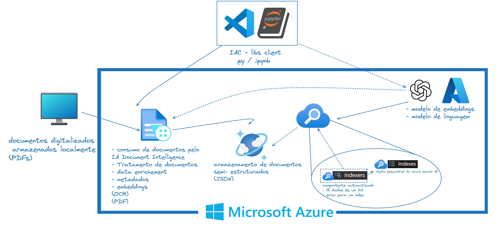

# RAG-app-Azure
Deploying a RAG application using only Azure cloud solutions.

# Arquitetura para IA Generativa - LLMs

Abaixo, trago o desenho de uma arquitetura para IA generativa voltada para LLMs, usando alguns serviços da Azure, como:

- **IA Document Intelligence**: para OCR em documentos digitalizados, permitindo tratamento e manuseio de informações.
- **Cosmos DB**: para armazenamento otimizado de dados.
- **Azure OpenAI**: para modelo de embeddings e modelo de linguagem.
- **Azure Search AI**: para indexação dos embeddings e busca de arquivos por similaridade de cosseno, alimentando o modelo de linguagem para concluir o RAG.

### sobre os arquivos:
- **Modulo get_embeddings.py**: Instanciando cliente azure open ai e definindo função para gerar embeddings.

---

# Architecture for Generative AI - LLMs

Above, I present a design for a generative AI architecture focused on LLMs, using several Azure services such as:

- **AI Document Intelligence**: for OCR on digitized documents, allowing for the processing and handling of information.
- **Cosmos DB**: for optimized data storage.
- **Azure OpenAI**: for the embedding model and language model.
- **Azure Search AI**: for indexing embeddings and searching for files by cosine similarity, feeding the language model to complete the RAG.

### about the files:
- **get_embeddings.py module**: Instantiating the azure open ai client and defining the function to generate embeddings.
